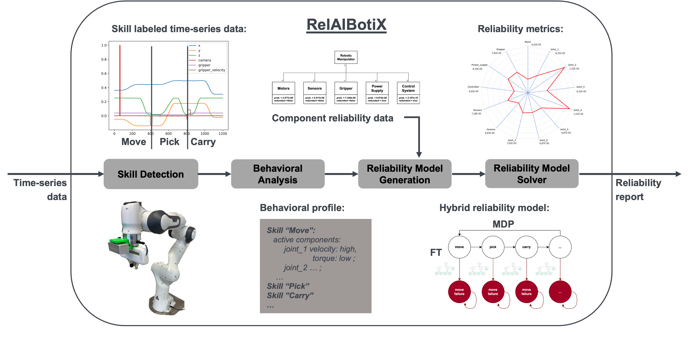

# RelAIBotiX <!-- omit from toc -->
Dynamic Reliability Assessment Framework for AI-Controlled Robotic Systems

## Table of Contents <!-- omit from toc -->
- [Introduction](#introduction)
- [Approach](#approach)
- [Installation](#installation)
- [Usage](#usage)
  - [Command-line Arguments](#command-line-arguments)
  - [Running the Analysis](#running-the-analysis)

## Introduction
AI-controlled robotic systems can introduce significant risks to both humans and the environment. Traditional reliability assessment methods fall short in addressing the complexities of these systems, particularly when dealing with black-box or dynamically changing control policies. These traditional approaches are applied manually and do not consider frequent software updates. 

RelAIBotiX presents a new methodology that enables dynamic and continuous reliability assessment, specifically tailored for robotic systems controlled by AI algorithms.

## Approach

The application of the RelAIBotiX framework requires three key steps:

### 1. Data Generation
To utilize the framework, time-series data must be collected from either a real robotic system or its corresponding simulation. The recorded data may include:
- Position, velocity, and torque of the gripper
- Position, velocity, and torque of the joints
- Cartesian coordinates of the manipulator and its orientation

### 2. Reliability Assessment
RelAIBotiX performs a comprehensive reliability assessment based on the collected time-series data. This assessment consists of four key methods:
- **Skill Detector**: Identifies robotic skills from time-series data
- **Behavioral Analysis**: Evaluates how system behavior impacts reliability
- **Reliability Model Generator**: Constructs reliability models such as Markov chains and fault trees
- **Reliability Model Solver**: Computes failure probabilities and performs sensitivity analysis

The result is a detailed reliability report, which includes:
- Overall system reliability
- Probability of failure for individual skills
- Sensitivity analysis of critical components

### 3. Decision Making
Using the generated reliability report, an informed decision can be made regarding the deployment of a control policy on the real robotic system. If the reliability assessment indicates potential risks, adjustments can be made before execution to improve the safety and robustness of the policy.

## Installation

```bash
git clone https://github.com/your-username/RelAIBotiX.git
cd RelAIBotiX
pip install -r requirements.txt
```

## Usage

To run the **RelAIBotiX** framework, use the `relaibotix_handler.py` script with the required arguments.

### **Command-line Arguments**

| Argument         | Description                                       | Example                                   |
|-----------------|---------------------------------------------------|-------------------------------------------|
| `--config`      | Path to the robot configuration JSON file         | `../config_files/franka_config.json`      |
| `--dataset`     | Path to the dataset (.npy file)                   | `../datasets/pick_place_dataset_franka.npy` |
| `--json_output` | Path to save the reliability report as JSON | `../output/robotic_system_openM.json`    |
| `--spider_chart` | Path to save the generated spider chart           | `../plots/spider_chart_openM.png`        |
| `--pdf_output`  | Path to save the PDF report                       | `../output/robot_report_openM.pdf`       |

### **Running the Analysis**

Execute the following command to perform a reliability assessment:

```bash
cd src
python relaibotix_handler.py \
  --config ../config_files/franka_config.json \
  --dataset ../datasets/pick_place_dataset_franka.npy \
  --json_output ../output/robotic_system_openM.json \
  --spider_chart ../plots/spider_chart_openM.png \
  --pdf_output ../output/robot_report_openM.pdf
```

## Skill Detector (Upcoming Integration)

> ⚠ **Note:** The **Skill Detector** module, which identifies robotic behaviors from time-series data, is currently maintained in a separate repository. It will be integrated into **RelAIBotiX** soon. Until then, a placeholder method is used. Future updates will provide seamless integration, allowing full automation of the skill detection and analysis process.

## Citation
```bibtex

```


## License
This project is licensed under the MIT License.


