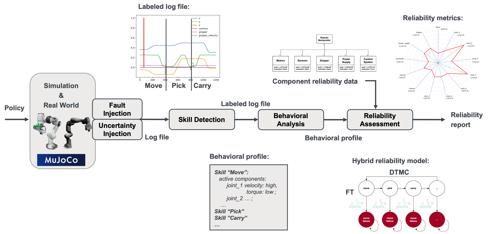

# RelAIBotiX <!-- omit from toc -->
[](https://github.com/pylint-dev/pylint)

Dynamic Reliability Assessment Framework for AI-Controlled Robotic Systems

## Table of Contents <!-- omit from toc -->
- [Introduction](#introduction)
- [Approach](#approach)
- [Installation](#installation)
- [Usage](#usage)
  - [Command-line Arguments](#command-line-arguments)
  - [Running the Analysis](#running-the-analysis)

## Introduction
AI-controlled robotic systems can introduce significant risks to both humans and the environment. Traditional reliability assessment methods fall short in addressing the complexities of these systems, particularly when dealing with black-box or dynamically changing control policies. These traditional approaches are applied manually and do not consider frequent software updates. 

RelAIBotiX presents a new methodology that enables dynamic and continuous reliability assessment, specifically tailored for robotic systems controlled by AI algorithms.

## Approach



```bash
git clone https://github.com/your-username/RelAIBotiX.git
cd RelAIBotiX
pip install -r requirements.txt
```

## Usage

To run the **RelAIBotiX** framework, use the `handler.py` script.

### **Command-line Arguments**

| Argument         | Description                                       | Example                                   |
|-----------------|---------------------------------------------------|-------------------------------------------|
| `--config`      | Path to the robot configuration JSON file         | `../config_files/franka_config.json`      |
| `--dataset`     | Path to the dataset (.npy file)                   | `../datasets/pick_place_dataset_franka.npy` |
| `--json_output` | Path to save the reliability report as JSON | `../output/robotic_system_openM.json`    |
| `--spider_chart` | Path to save the generated spider chart           | `../plots/spider_chart_openM.png`        |
| `--pdf_output`  | Path to save the PDF report                       | `../output/robot_report_openM.pdf`       |


## License
This project is licensed under the MIT License.


